# Slack HelloWorld Application

[](https://david-dm.org/joeireland/slack-helloworld)

An example Slack application built using the Node.js [AWS Serverless Express](https://github.com/awslabs/aws-serverless-express). The application when deployed to AWS makes use of an API Gateway and Lambda.

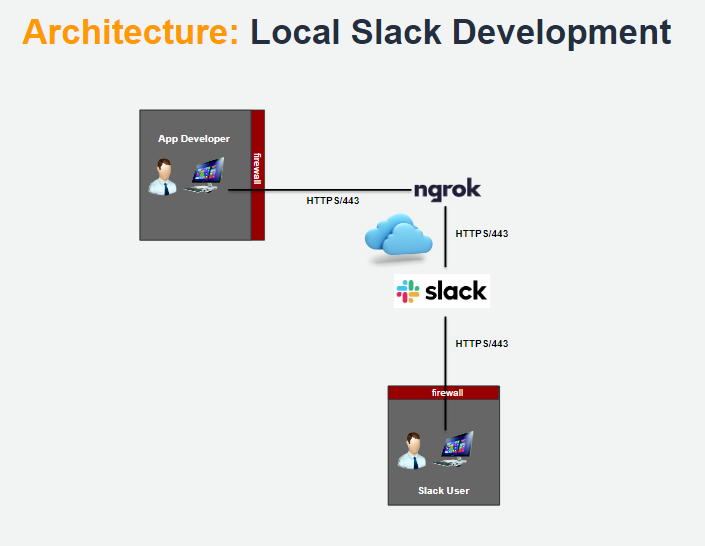

### Build and Test Locally using Ngrok

- Start a **bash** shell and enter the following:

```bash
npm install
export PORT=3000
npm start
```

- Start another **bash** shell and type the following:

```bash
ngrok http 3000
```

- With your web browser, login to https://ngrok.com
- Select **Status/Tunnels**
- Take note of your tunnel's HTTPS URL (you will use this when configuring your slash command within Slack)
- With your web browser, login to your Slack workspace
- Select **Apps** followed by **App Directory** in the upper right corner
- Select **Build** followed by **Your Apps** in the upper right corner
- Press **Create New App** button
- Enter an App Name of HelloWorld
- Select your Development Slack Workspace
- Press the **Create App** button

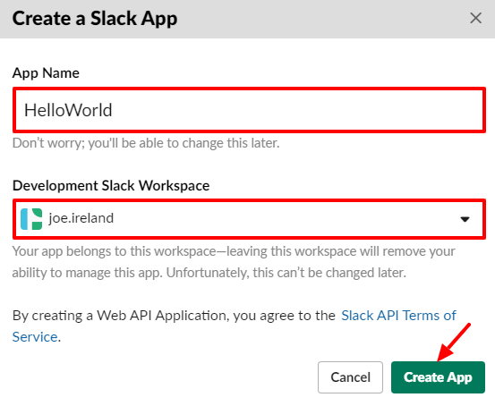

- Select **Slash Commands**
- Press the **Create New Command** button

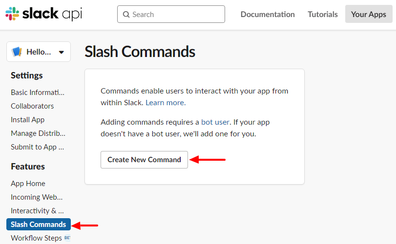

- Enter a Command of **/hello**
- Enter your Request URL equal to the Ngrok HTTPS URL followed by **/hello**
- Enter a Short Description of **Say Hello!!!**
- Press the **Save** button

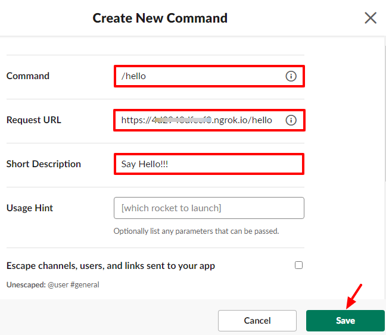

- Select **OAuth & Permissions**
- Press the **Install App to Workspace** button

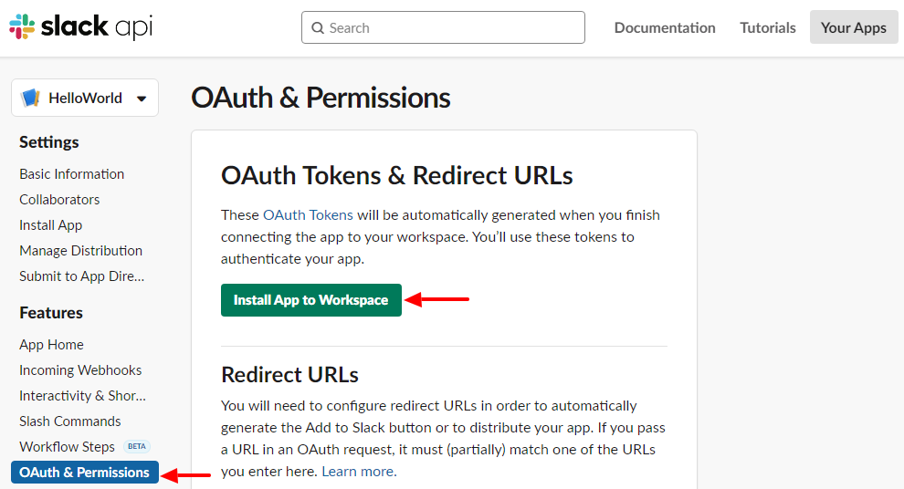

- Now you can test your **/hello** command
- Select a channel and enter **/hello**

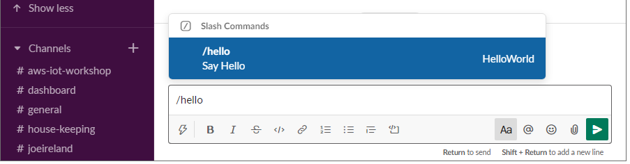

- You will see output similar to this

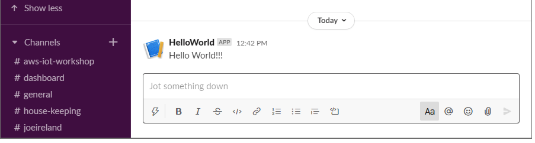

---

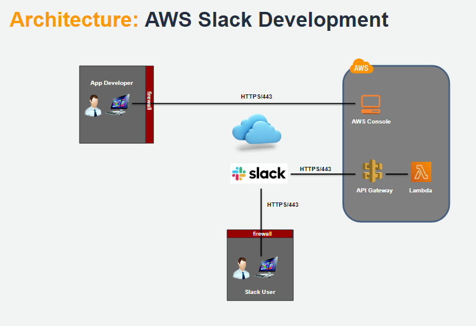

- **NOTE:** When executing **npm run config** below use your own account, region and create your own globally unique S3 bucket name.

```bash
npm run config -- --account-id="844663253475" --bucket-name="helloworld9912" --function-name="helloworld" --region="us-east-1"
npm run setup
```

- Login to your AWS console
- Under services select **CloudFormation**
- Select **helloworld**

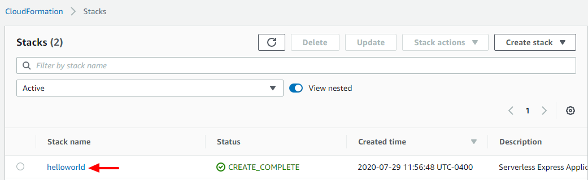

- Select the **Outputs** tab
- Take note of the **ApiUrl** value (you will use this when configuring your slash command within Slack)

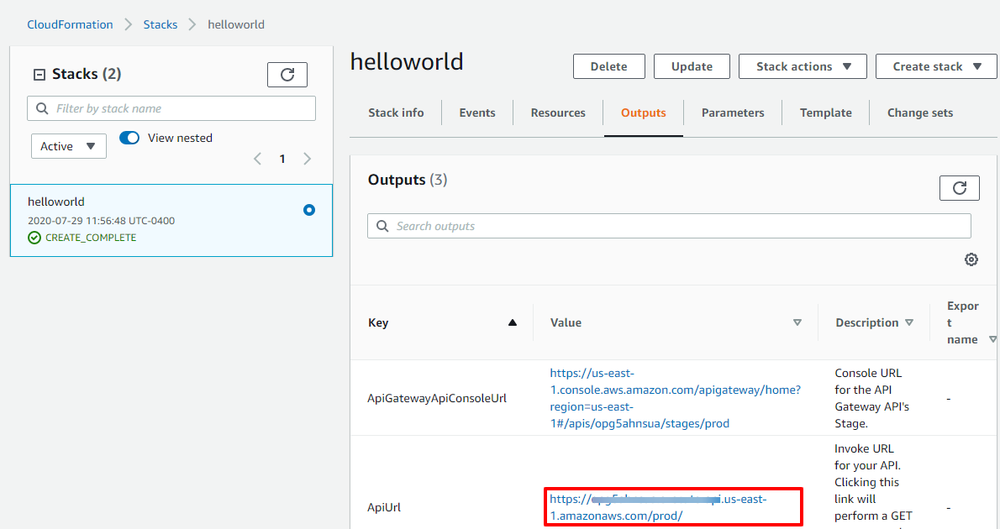

**NOTE:** If you were previously developing locally you will now edit your existing slash command to use your newly deployed Lambda function as described below. If not then you will need to create a new slash command as described above. In that case replace the **request URL** with the **ApiUrl** you took note of previously)

- With your web browser, login to your Slack workspace
- Select **Apps** followed by **App Directory** in the upper right corner
- Select **Build** followed by **Your Apps** in the upper right corner
- Select **HelloWorld** to edit the app

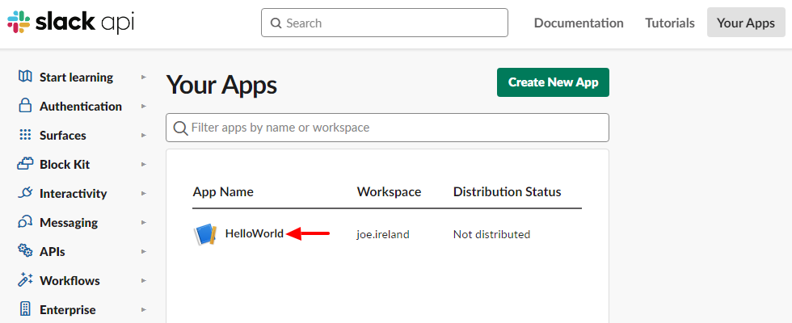

- Select **Slash Commands**
- Press the pencil icon to edit the slash command

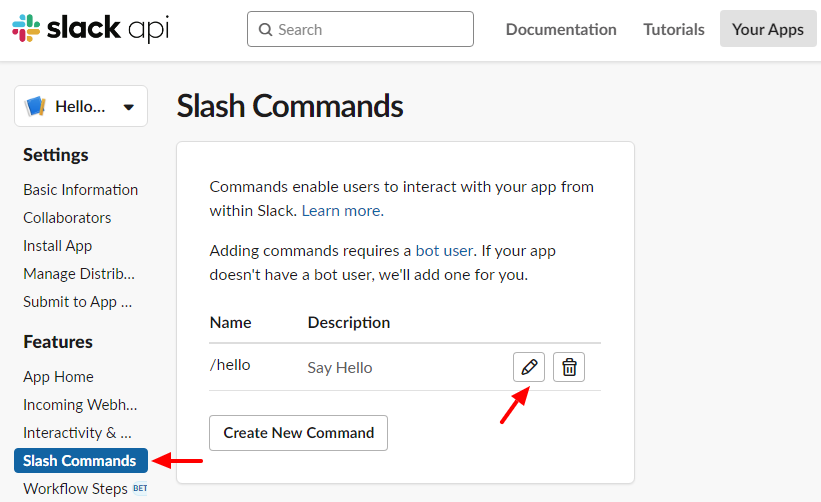

- Enter a Request URL equal to your **ApiUrl** value you took note of earlier followed by **/hello**
- Press the **Save** button

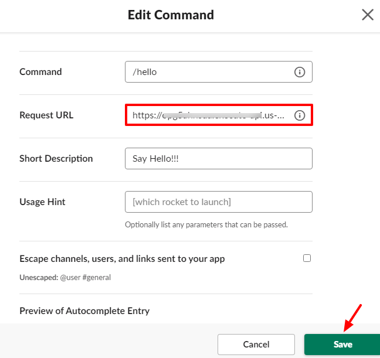

- Now you can test your **/hello** command
- Select a channel and enter **/hello**


- You will see output similar to this


